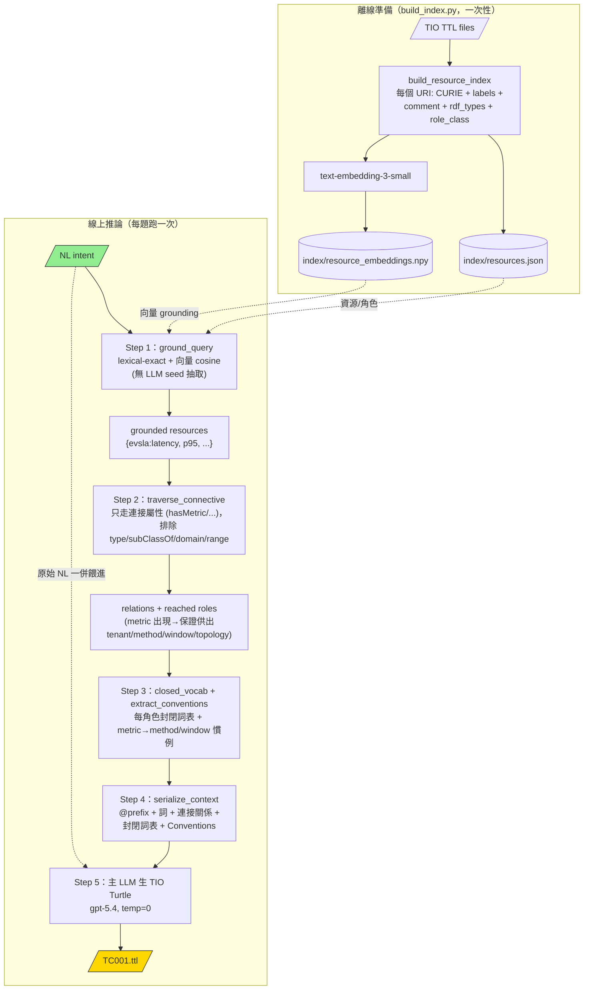
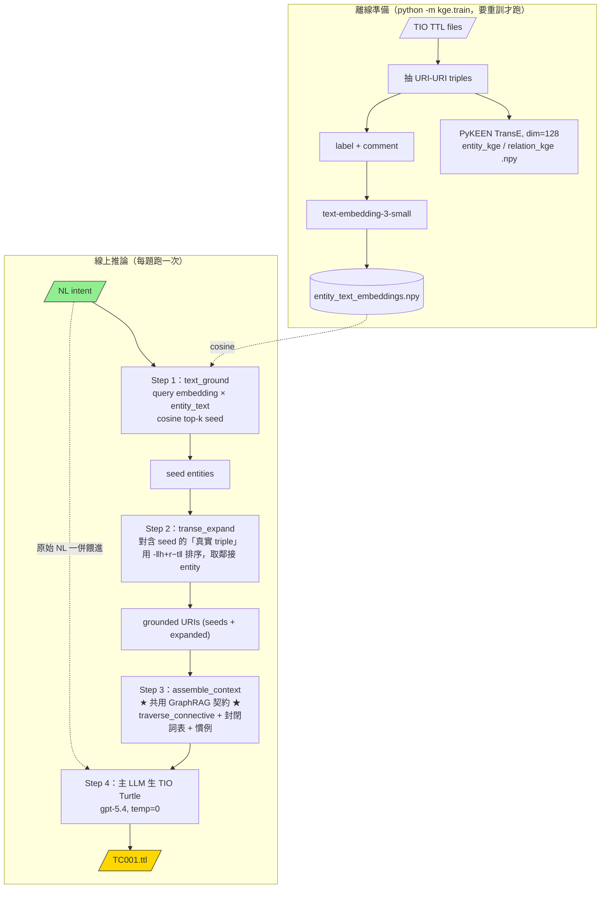
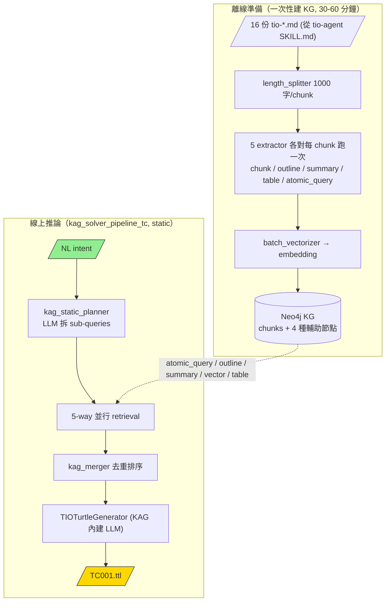

# mechanism.md — GraphRAG / KGE / KAG 三條 pipeline 的運作機制

> 本文件用同一題（TC001）貫穿三條 pipeline，逐步示範資料在每個階段「長什麼樣子」。
> 評分數據與整體比較見 `progress.md`（Architecture 1→5）與 `phase1/output_quality/compare_four_way.txt`，本檔不重複。
>
> **版本（2026-06-16，對齊 Architecture 5）**：GraphRAG 已是 **ontology-aware domain-graph RAG**（不是早期的 typed-BFS，更不是 Microsoft GraphRAG CLI）；KGE 已是 **canonical 版**（text-embedding grounding + TransE link-prediction 排序「真實 triple」，**不再做 neighborhood expansion / 不合成 triple**），且與 GraphRAG **共用輸出契約**。KAG 維持原樣。

---

## 0. 共用前提

### 0.1 任務

把**自然語言意圖（NL intent）**轉成 **TIO Turtle**（TM Forum Intent Ontology 規格的 Turtle/RDF），下游 orchestrator 才能消費。

### 0.2 共用元件

| 元件 | 角色 |
|---|---|
| `test_cases_20.json` / `test_cases_40.json` | 20 題 / 40 題（含 20 題 hub-and-spoke，structure-only 用）測資（NL intent + 預期 ontology 詞彙）|
| `few_shot_samples.json` / `few_shot_structure_only.json` | 強配方 few-shot（含 EVSLA 詞彙）/ structure-only sanitized skeleton（佔位符、無詞彙）|
| `evsla_prompt.build_evsla_system_prompt` | 共用 system prompt（profile：`strong` / `weak` / `structure_only`）|
| `GraphRag/resource_index.py`、`graph_relations.py`、`context_builder.py` | **GraphRAG 與 KGE 共用的輸出契約**：資源索引 + 連接屬性 traversal + context 序列化 |
| LLM | `gpt-5.4`，三條同款，temperature=0 |
| `TM Forum Intent Ontology/*.ttl` | TIO v3.6.0 ontology（14+ namespace：evsla / icm / imo / met / quan / fun …）|
| `evaluate_ttl.py` + `semantic_eval.py` | 評分器：parse / expected-element 覆蓋 + **11 維 graph-binding composite**（metric / threshold / statistic / scope / measurement_method / time_window / operator / tenant / topology / contract / precision）|

> ⚠️ 早期版本用「Avg Ontology coverage / Verbosity」當指標,已被 `semantic_eval` 的 11 維 composite 取代。強配方（`test_cases_20`）四條已飽和到 composite ~1.0,失去鑑別力;**現在的主戰場是 structure-only（`test_cases_40`，抽掉 EVSLA 詞彙,只靠 retrieval 供詞）**。

### 0.3 貫穿全文的範例：TC001

```json
{
  "id": "TC001",
  "tenant": "星河銀行",
  "scope": { "hub": "台北總部", "spokes": ["新竹分行", "台中分行", "高雄分行"] },
  "nl_intent": "確保星河銀行總部至所有分點之延遲在95%的時間內低於50ms。",
  "performance_metrics": [{
    "ontology_term": "evsla:latency", "operator": "LESS_THAN",
    "threshold": {"value": 50, "unit": "ms"}, "statistic": "evsla:p95",
    "scope": "evsla:hubToAllSpokes", "measurement_method": "evsla:twamp",
    "time_window": "evsla:fiveMinuteWindow"
  }]
}
```

---

## 為什麼 retrieval 一定要保留「結構」— 一個踩過兩次的雷

> GraphRAG 這條 pipeline **重寫過兩次**，每次都是同一個教訓的延伸。值得先看，因為它同時解釋了 KAG 為什麼 ontology 命中率最低。

**第一次踩雷（Microsoft GraphRAG CLI，已淘汰）**：最早直接呼叫官方 `graphrag` CLI，它把 TTL 當「未結構化文件」切 chunk → entity extraction → community detection → community summary，經過三道 LLM 重寫後，**`evsla:latency`、`icm:PropertyExpectation` 這些 URI 全被洗成「latency」「property expectation」普通名詞**。主 LLM 看到散文摘要，生不出帶 URI 的 Turtle（TC001 evsla URI 命中 = **0**）。→ 2026-05-19 改寫成直接讀 TTL 的 typed RDF traversal。

**第二次重設計（typed-BFS → domain-graph，現行）**：typed-BFS 雖然保住了 URI，但它**只沿 `rdf:type/subClassOf/domain/range` 這些 TBox plumbing 走**，灌進 prompt 的多半是「schema 骨架」雜訊,token 爆（~13.5k/題）而語意綁定不準。Architecture 3 再改成 **domain-graph traversal**：反過來**只走有意義的連接屬性**（`hasMetric/hasThreshold/...`），**排除** plumbing,並改用 role-scoped 封閉詞表。token 砍到 ~½、品質反而升。

**通則（這份實驗的核心結論之一）**：

| 資料是否結構化 | 送進主 LLM 的 context | 結果 |
|---|---|---|
| 結構化（TTL）| 結構化（**連接屬性** + 封閉詞表 + 慣例）| ★ GraphRAG / KGE 現行：structure-only composite ~0.98 |
| 結構化（TTL）| 結構化但全是 plumbing | typed-BFS 舊版：token 爆、綁定不準 |
| 結構化（TTL）| **非結構化**（community 摘要）| Microsoft CLI：URI 命中 ~0 |
| 非結構化（SKILL.md）| 非結構化（自然語言 chunk）| KAG：corpus 本來就沒 URI，命中率被拖累 |

**retrieval 階段保留 source data 的結構（而且是「有用的那部分」結構），直接決定下游 LLM 能不能生出 schema-compliant 輸出。**

---

## 1. GraphRAG（ontology-aware domain-graph RAG）

> 核心：**對 NL 做 lexical + vector grounding → 在 ontology 上只走「連接屬性」的有界 traversal → 供出 role-scoped 封閉詞表 + 領域慣例 → 自含 @prefix 的 context 餵 LLM**。**沒有 LLM 抽 seed 那一步**（已移除）。
> 入口：`GraphRag/nl_to_tio.py`；核心邏輯：`resource_index.py` + `graph_relations.py` + `subgraph_retriever.py` + `context_builder.py`。



### 1.1 離線準備（`build_index.py`，一次性；TTL 變更才重建）

`build_resource_index()` 把 `TM Forum Intent Ontology/*.ttl` 讀成 `rdflib.Graph`，對每個 URI 產生一筆 `OntologyResource`：CURIE、`labels`、`alt_labels`、`comment`、`rdf_types`、**`role_class`**（Statistic / Scope / MeasurementMethod / TimeWindow / Tenant / HubSite / SpokeSite / HubAndSpokeTopology / ComparisonOperator / Metric）。再把每個 resource 的文字（label+comment）用 `text-embedding-3-small` 算向量,存 `index/resource_embeddings.npy`。

> 沒有 index 時 grounding 退化成 lexical-only；rdflib 讀 TTL 與 traversal 都是執行期完成，只有「向量 grounding 的 embedding」需要這個離線 index。

### 1.2 線上推論（每題跑一次）

#### Step 1：ground_query — lexical + vector（無 LLM）

`ground_query(query, resources, embeddings, query_vector)`：先做 lexical-exact 比對（label / alt_label），再用 query 的 embedding 對 `resource_embeddings.npy` 算 cosine 補召回（synonym / 非字面命中）。**不再用 LLM 抽 seed**（`test_no_seed_selection_caller_present` 守著這件事）。

**TC001**：`確保星河銀行總部至所有分點之延遲在95%的時間內低於50ms。` →
grounded ＝ `{evsla:latency, evsla:p95, evsla:hubToAllSpokes, ...}`（租戶名 / 數字不會 ground 成 ontology 詞）。

#### Step 2：traverse_connective — 只走連接屬性

`traverse_connective(graph, grounded)` 從 grounded URI 出發，**只沿 EVSLA 的連接屬性**走：
```
hasMetric, hasThreshold, hasStatistic, hasScope,
hasMeasurementMethod, hasTimeWindow, hasHub, hasSpoke, forTenant
```
**刻意排除** `rdf:type / rdfs:subClassOf / rdfs:domain / rdfs:range` 這些 TBox plumbing（這正是 typed-BFS 舊版的雜訊來源）。回傳 `relations`（連接關係）與 `reached`（命中的角色集合）。

**四維度 grounding 修正（Architecture 5）**：只要 grounded 裡有 metric（即存在一條 SLA expectation），就**保證**把 `Tenant / MeasurementMethod / TimeWindow / HubSite / SpokeSite / HubAndSpokeTopology` 補進 `reached`,並 emit `forTenant / hasHub / hasSpoke` 關係,讓這些 **class IRI** 進 context（tenant / hub / spoke 是每題自造的節點,需要 class 來 typing,而非實例詞）。

**TC001**：reached ＝ `{Metric, Statistic, Scope, MeasurementMethod, TimeWindow, Tenant, HubSite, SpokeSite, HubAndSpokeTopology, ComparisonOperator}`。

#### Step 3：封閉詞表 + 領域慣例

- `closed_vocab_for_reached_roles(reached, resources)`：對每個命中角色,列出該角色的**封閉候選詞**（如 Statistic: `evsla:p95, evsla:p99`；TimeWindow: `evsla:fiveMinuteWindow, oneHourWindow, monthlySlaWindow`）。LLM 只能從清單挑,杜絕亂造。
- `extract_conventions(graph)`（Architecture 5）：從 TTL 讀領域慣例 —
  - **metric → 預設 measurement method**：`evsla:latency/packetLoss → evsla:twamp`、`evsla:guaranteedBandwidth → evsla:activeMeasurement`（`evsla:defaultMeasurementMethod` triple）。
  - **預設 time window**：`evsla:fiveMinuteWindow`（`evsla:isDefaultTimeWindow` 標記）；NL 出現「每小時視窗」→ `oneHourWindow`、「月度SLA視窗」→ `monthlySlaWindow`（靠 window instance 上的中文 `rdfs:label@zh`）。

> 為什麼要慣例：NL 通常**不會講** measurement method / time window（TC001 沒提 twamp、5 分鐘）,這些是領域預設,必須由 retrieval 從 ontology 供出,LLM 才補得對。這就是 tenant=0.00→0.98、measurement_method=0.35→0.93 的關鍵。

#### Step 4：serialize_context — 自含 context

`serialize_context()` 輸出一段自含的 context：`### Canonical prefixes`（@prefix 全宣告）+ `### Grounded terms` + `### Connective relations`（如 `evsla:SlaExpectation evsla:hasMetric -> evsla:latency`、`evsla:HubAndSpokeTopology evsla:hasHub -> evsla:HubSite`）+ `### Closed vocabulary per reached role` + `### Conventions`。

#### Step 5：LLM 生成

`generate_turtle_code()` 用 `build_evsla_system_prompt(profile)` + few-shot + NL + 上面的 context 呼叫 `gpt-5.4`（temp=0），回 pure TIO Turtle。

**TC001 最終輸出**（節錄,**SLA 綁定 predicate 掛在 expectation 上** — 見 §1.3）：
```turtle
@prefix icm:   <http://tio.models.tmforum.org/tio/v3.6.0/IntentCommonModel/> .
@prefix evsla: <http://tio.models.tmforum.org/tio/v3.6.0/EnterpriseVpnSlaOntology/> .
@prefix quan:  <http://tio.models.tmforum.org/tio/v3.6.0/QuantityOntology/> .
@prefix ex:    <http://example.org/tio-instance/tc001/> .

ex:intent a icm:Intent, evsla:EnterpriseVpnSlaIntent ;
  icm:intentElements ex:exp-latency, ex:topology .
ex:tenant a evsla:Tenant ; rdfs:label "星河銀行"@zh .
ex:exp-latency a icm:PropertyExpectation, evsla:SlaExpectation ;
  icm:target ex:tgt-latency ;
  evsla:hasMetric evsla:latency ;
  evsla:hasStatistic evsla:p95 ; evsla:hasScope evsla:hubToAllSpokes ;
  evsla:hasMeasurementMethod evsla:twamp ; evsla:hasTimeWindow evsla:fiveMinuteWindow ;
  evsla:hasThreshold [ a quan:Quantity ; rdf:value 50 ; quan:unit "ms" ] .
ex:tgt-latency a icm:Target ;
  icm:valuesOfTargetProperty [ a quan:Quantity ; rdf:value 50 ; quan:unit "ms" ] .
ex:topology a icm:Context, evsla:HubAndSpokeTopology ;
  evsla:hasHub [ a evsla:HubSite ; rdfs:label "台北總部"@zh ] ;
  evsla:hasSpoke [ a evsla:SpokeSite ; rdfs:label "新竹分行"@zh ] .
```

### 1.3 評分器與 ontology domain 對齊（Architecture 5）

`semantic_eval.py` 從 **expectation 節點**讀 SLA 綁定 predicate（`hasMetric` 等），因為 ontology 宣告它們的 `rdfs:domain` 是 `evsla:SlaExpectation`；讀不到再 fallback 到 `icm:Target`（向後相容舊輸出）。few-shot 與 structure-only 骨架也改成把綁定掛 expectation、target 只留 `icm:valuesOfTargetProperty` —— **ontology / few-shot / scorer 三方對齊**。

---

## 2. KGE（canonical：text-embedding grounding + TransE link-prediction）

> 核心：**text embedding 找 seed（吃同義詞）→ TransE 對「真實 triple」排序做擴張（永不合成）→ 套用與 GraphRAG 完全相同的輸出契約**。
> 入口：`KGE/KGE-based-graphrag/nl_to_tio.py`；核心邏輯：`kge/select.py`（`text_ground` + `transe_expand` + `assemble_context`）+ `kge/train.py`。



### 2.1 離線準備（`python -m kge.train`，TTL 變更才重訓）

1. 抽 ontology 的 **URI-URI** triples。
2. PyKEEN **TransE**（`dim=128`）→ `entity_kge_embeddings.npy`（~392×128）+ `relation_kge_embeddings.npy`（~12×128）。TransE 假設 `vec(h)+vec(r) ≈ vec(t)`。
3. 每個 entity 的文字（label+comment）→ `text-embedding-3-small` → `entity_text_embeddings.npy`（~392×1536）。

至此有**兩套向量**：圖結構（TransE）與語意（text）。

### 2.2 線上推論（每題跑一次，`build_kge_context`）

#### Step 1：text_ground — dense 語意 grounding

把 NL 用 `text-embedding-3-small` embed,對 `entity_text_embeddings` 算 cosine,取 top-k entity 當 seed。好處是吃得到「字面不同但語意相近」的詞。

#### Step 2：transe_expand — 只排序「真實 triple」

`transe_expand(seeds)`：掃過 `triples.tsv` 裡**真實存在**、且含某個 seed 的 triple,用 TransE 分數 `-‖h+r−t‖` 排序,取 top-k triple 的鄰接 entity 加入。**關鍵:它只從真實 triple 取 entity,永不合成新 triple、不造詞**（這正是「誤用版」KGE 被砍掉的三件事之一:舊版會 dump predicted-triples-as-facts + neighborhood expansion + 百科 term-hint）。

#### Step 3：assemble_context — 共用 GraphRAG 契約

`assemble_context(seeds + expanded)` 直接呼叫 GraphRAG 的 `traverse_connective` + `closed_vocab_for_reached_roles` + `extract_conventions` + `serialize_context`。**輸出格式與 GraphRAG 一字不差**。

#### Step 4：LLM 生成

跟 GraphRAG 同一支 `build_evsla_system_prompt`,只是 retrieval block 來自 KGE。

> **為什麼 KGE 與 GraphRAG 分數/ token 幾乎打平（0.9831 vs 0.9827、2,637 vs 2,722）**：重設計後兩條**只差「選種子機制」**（KGE = text-emb + TransE 真實擴張;GraphRAG = lexical + 確定性 traversal),其後「種子→輸出」的契約完全共用。在這個小而固定的 schema 上,ground 到任一 SLA value 詞就點亮整個角色菜單,所以殊途同歸。

---

## 3. KAG（OpenSPG/KAG kg-builder + 5-way solver）

> 核心：**把 corpus 灌進 Neo4j，每份 chunk 同時建 outline / summary / table / atomic_query 多種索引，query 時 5 路 retriever 並行，再讓 KAG generator 直接生 TIO Turtle**。
> 入口：`KAG/nl_to_tio.py`；後端：Docker stack（OpenSPG server + Neo4j + MySQL + MinIO）。
> ⚠️ KAG **沒有 structure-only 版**（沒抽詞彙的對照),只有強配方結果;且未隨 GraphRAG/KGE 重設計而改。



### 3.1 離線：建 KG（`builder/indexer.py`，~30-60 分鐘）

對 `builder/data/tio-*.md`（16 份 corpus，從 tio-agent SKILL.md 複製來）做：md_reader → length_splitter（1000 字/chunk）→ **5 個 extractor**（`chunk` / `outline` / `summary` / `table` / `atomic_query`，4 個會打 LLM）→ batch_vectorizer → 寫進 Neo4j。

**範例**：`tio-enterprise-vpn-sla.md` 裡一段 TWAMP chunk 會在 Neo4j 建出 `(:Chunk)`、`(:Outline)`、`(:Summary)`、多個 `(:AtomicQuery)`（如「What protocol measures hub-spoke latency?」）並互相連邊、打 embedding。成本 ~400-800 次 LLM call、< $10。

### 3.2 線上：5-way solver（每題跑一次）

1. **Planner**：`kag_static_planner` 把 NL 拆成 sub-queries。
2. **5-way retrieval**：每個 sub-query 同時跑 `atomic_query` / `outline` / `summary`（thr=0.8）/ `vector`（thr=0.8）/ `table` 五個 retriever（各 top_k=10）→ `kag_merger` 去重排序。
3. **Generator**：`TIOTurtleGenerator` 把 retrieved chunks 序列化成 task blocks,用 `TIOTurtleGeneratorPrompt`（固定 @prefix、expectation/target 骨架、hub-spoke context）在 KAG 內建 LLMClient 下呼叫 `gpt-5.4`,直接吐 pure Turtle。
4. **輸出**：`strip()` 後寫到 `tio_outputs/kag/TC001.ttl`。

**為什麼 KAG ontology 命中率最低**：retrieval 拉回來的是**自然語言段落**(corpus 本來就是 SKILL.md,沒有 URI),LLM 要自己從散文腦補 URI,命中率不如 GraphRAG/KGE 直接給 CURIE。這跟 Microsoft GraphRAG CLI 是同一個雷,差別只在 KAG 的 corpus 一開始就沒有 URI 可保留。

---

## 4. 三條 pipeline 一頁速覽

| 階段 | GraphRAG | KGE | KAG |
|---|---|---|---|
| **知識來源** | TIO TTL（直接讀）| TIO TTL → TransE + 文字向量 | 16 份 SKILL.md（自然語言）|
| **離線索引** | resource index + 文字 embedding（`index/`）| TransE `.npy` + 文字 `.npy`（`kge_data/`）| Neo4j：chunks + outline/summary/table/atomic_query |
| **Seed / Query 處理** | lexical-exact + 向量 cosine（**無 LLM**）| 文字 embedding cosine top-k | LLM planner 拆 sub-query |
| **Retrieval 主邏輯** | 連接屬性有界 traversal（排除 plumbing）+ 角色 reachability 保證 | TransE 對真實 triple 排序擴張（不合成）| 5-way parallel retriever + merger |
| **Context 格式** | @prefix + 連接關係 + 封閉詞表 + 慣例（**共用契約**）| **同 GraphRAG（共用契約）** | 自然語言 chunks + task results |
| **Generation** | 外部 OpenAI call | 外部 OpenAI call | KAG solver 內建 generator |
| **structure-only composite** | **0.9827** | **0.9831** | （無 structure-only 版）|
| **structure-only tok/case** | 2,722 | 2,637 | — |
| **strong 配方（20 題）** | ~1.0（飽和）| ~1.0（飽和）| ~0.997（飽和）|

> 對照基準：LLM-only strong 天花板 composite 0.9722 / 5,349 tok；structure-only floor 0.000 / 1,432 tok。retrieval 用 ~½ token 達到 ≈/超過天花板品質。

---

## 5. TC001 全程資料形狀對照（一眼看完）

| 階段 | GraphRAG | KGE | KAG |
|---|---|---|---|
| **輸入** | "確保星河銀行總部至所有分點之延遲在95%的時間內低於50ms。" | 同左 | 同左 |
| **第一步產出** | grounded URIs（lexical+向量）`{evsla:latency, p95, hubToAllSpokes, ...}` | text top-k seed entities | retrieval plan（sub-queries）|
| **擴張 / traversal** | 連接屬性 traversal + 角色 reachability 保證 | TransE 排真實 triple → 鄰接 entity | 5-way retriever → merger |
| **送進 LLM 的 context** | @prefix + 連接關係 + 封閉詞表 + Conventions | **同 GraphRAG（共用）** | task blocks（自然語言 chunk + thought）|
| **最終輸出** | latency/p95/hubToAllSpokes/twamp/fiveMinuteWindow + tenant/hub/spoke typing 都進 Turtle | 同上（殊途同歸）| 同上,但部分 URI 靠 LLM 從散文腦補 |

---

## 6. 一句話歸納

> **三條 pipeline 做的事一樣（NL → TIO Turtle），差別在 retrieval 怎麼把「結構」交到 LLM 手上。**
> - **GraphRAG**：直接吃 ontology 結構,只走有意義的連接屬性 + 供慣例,精度高、雜訊少。
> - **KGE**：用向量空間選種子(吃同義詞)+ TransE 排真實 triple,**其餘與 GraphRAG 共用契約** → 兩條殊途同歸。
> - **KAG**：最重型基礎設施,retrieval 多元,但 corpus 是自然語言、沒 URI 可保留,ontology 命中率被拖累。
>
> 貫穿三條的鐵律:**retrieval 保留多少「有用的結構」,就決定 LLM 能生出多 schema-compliant 的 TIO Turtle。**
