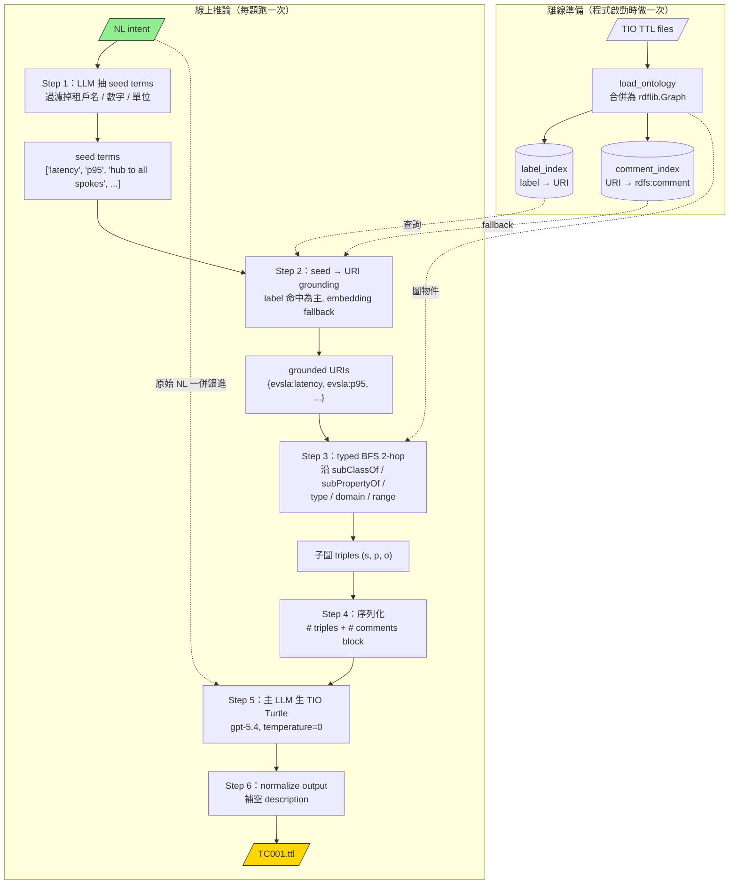
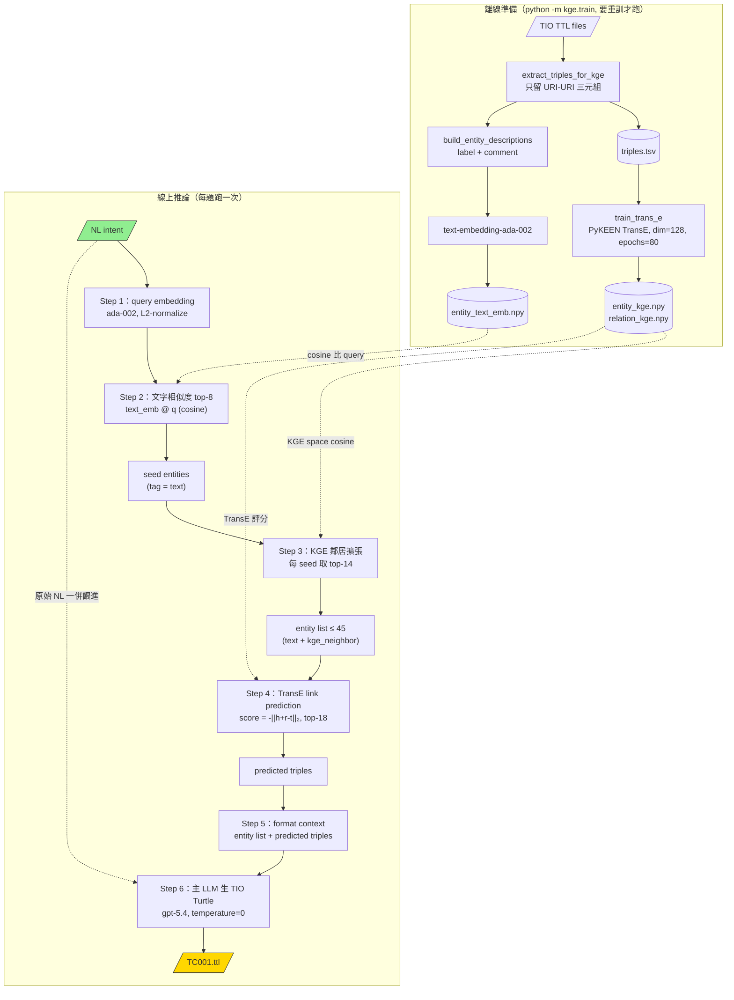
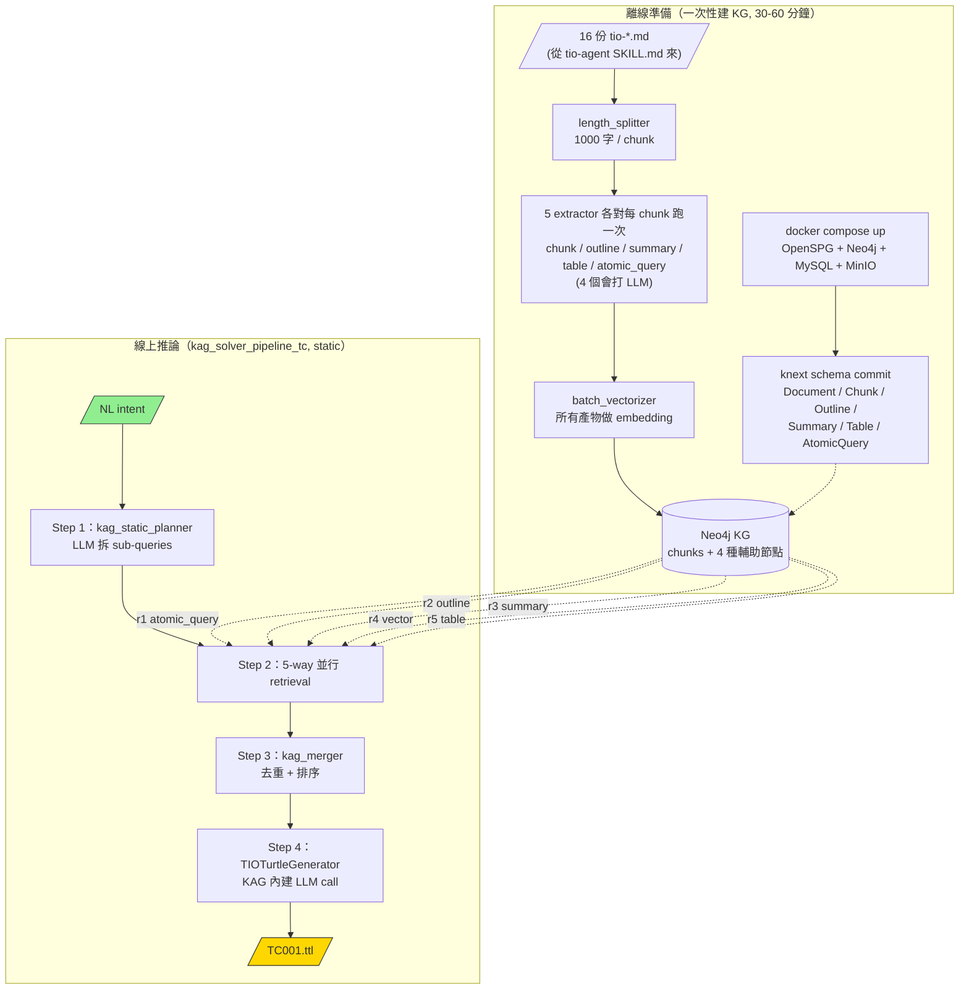

# mechanism.md — GraphRAG / KGE / KAG 三條 pipeline 的運作機制

> 本文件用同一題（TC001）貫穿三條 pipeline，逐步示範資料在每個階段「長什麼樣子」。
> 評分數據與整體比較見 `progress.md` 與 `phase1/compare_four_way.txt`，本檔不重複。

---

## 0. 共用前提

### 0.1 任務

把**自然語言意圖（NL intent）**轉成 **TIO Turtle**（TM Forum Intent Ontology 規格的 Turtle/RDF 文件），下游 orchestrator 才能消費。

### 0.2 共用元件

| 元件 | 角色 |
|---|---|
| `test_cases_20.json` | 20 題測資（NL intent + 預期 ontology 詞彙）|
| `few_shot_samples.json` | few-shot 範例（**不是測資**，只給 LLM 看 TIO Turtle 結構，`turtle` 欄位）|
| `evsla_prompt.build_evsla_system_prompt` | 三條共用的 system prompt（含 EVSLA 詞彙與 TIO Turtle 契約）|
| LLM | `gpt-5.4`，三條同款，temperature=0 |
| `TM Forum Intent Ontology/*.ttl` | TIO v3.6.0 ontology（14+ namespace：evsla / icm / imo / met / quan / fun …）|
| `evaluate_ttl.py` | 評分器：parse OK / ontology coverage / metric coverage / verbosity |

### 0.3 貫穿全文的範例：TC001

```json
{
  "id": "TC001",
  "tenant": "星河銀行",
  "scope": { "hub": "台北總部", "spokes": ["新竹分行", "台中分行", "高雄分行"] },
  "nl_intent": "確保星河銀行總部至所有分點之延遲在95%的時間內低於50ms。",
  "expected_tio_elements": [
    "icm:Intent", "icm:PropertyExpectation", "icm:Target",
    "icm:Context", "icm:valuesOfTargetProperty"
  ],
  "ontology_terms": [
    "evsla:EnterpriseVpnService", "evsla:EnterpriseVpnSlaIntent",
    "evsla:HubAndSpokeTopology", "evsla:HubSite", "evsla:SlaExpectation",
    "evsla:SpokeSite", "evsla:Tenant", "evsla:fiveMinuteWindow",
    "evsla:hubToAllSpokes", "evsla:latency", "evsla:p95", "evsla:twamp"
  ]
}
```

---

## 為什麼 GraphRAG 重寫過 — 舊版 vs 新版

> 這條 pipeline **不是一開始就用 typed BFS 的**。最早是直接呼叫 Microsoft 官方 `graphrag` CLI，但發現它的 retrieval 方式會把 TIO ontology 的 URI 全部洗成散文，LLM 拿到後 ontology coverage 趨近 0。所以在 2026-05-19 整個重寫成 typed RDF traversal（commit `2378241` / plan `docs/superpowers/plans/2026-05-19-graphrag-typed-traversal.md`）。
>
> 這段背景對讀後面三條 pipeline 的比較很重要 — 因為這個踩過的雷，也正好解釋了現在 KAG 為什麼 ontology coverage 是最低的。

### 舊版：Microsoft GraphRAG CLI

```text
TTL files
  → length_splitter（800 token / chunk）        ← 把 TTL 當散文切
  → entity_extraction（LLM 從 chunk 抽 entity）
  → community_detection（graph clustering）
  → community_summarization（LLM 對每個社群寫摘要）
  → query 時用向量比對 community summary
  → 主 LLM 看到「community 摘要散文」
```

**問題**：TTL 本來就是結構化的 URI / triple，但 Microsoft GraphRAG 把它當「未結構化文件」處理。經過三層 LLM 重寫後，**`evsla:latency`、`icm:PropertyExpectation` 這些 URI 全部變成「latency」「property expectation」這種普通名詞**，主 LLM 看完當然不會生出帶 URI 的 TIO Turtle。

**證據**：重寫前 TC001 的 evsla URI 數 = **0** 個（`docs/superpowers/plans/2026-05-19-graphrag-typed-traversal.md` Task 11 step 4 留下的驗收 baseline:`Expected: count >= 5 (was 0 before this refactor)`）。

舊版 Microsoft GraphRAG 的 artifact(`output/*.parquet`、`lancedb/`、`settings.yaml`、`cache/`)已移除;現行 `nl_to_tio.py` 以 rdflib typed traversal 直接讀 ontology TTL,不需要這些。

### 新版：typed RDF traversal（2026-05-19 重寫）

```text
TTL files
  → rdflib 直接載入（保留 URI 結構）
  → 建 label_index + comment_index
  → seed extraction（LLM 抽 ontology terms）+ grounding（label / embedding）
  → typed BFS 2-hop（5 種 RDFS predicate）
  → 子圖序列化為 # triples + # comments
  → 主 LLM 看到 CURIE 結構化 triples
```

**好處**：**完全跳過 chunk / community detection 那一整段**。LLM 看到的是 `evsla:latency rdfs:subPropertyOf met:metric` 這種可以直接抄的 CURIE，不用「腦補」URI。

**結果**：TC001 的 evsla URI 數 = **15+**；Avg Ontology coverage 從 ~0 →  **0.9889**；Verbosity OK 100%。

### 兩版差異對照

| 面向 | 舊版（Microsoft graphrag CLI） | 新版（typed BFS） |
|---|---|---|
| 資料處理 | 把 TTL 當文字切 chunk | 直接讀 TTL 為 rdflib.Graph |
| 中介層 | 3 道 LLM 重寫（extraction / clustering / summary）| 0 道（純圖演算法）|
| 主 LLM 看到的 context | community 摘要散文 | CURIE triples + comments |
| URI 是否保留 | ❌ 洗掉 | ✅ 完整保留 |
| 離線成本 | 高（每份 TTL 多次 LLM call）| 低（只需載入 + 建索引）|
| TC001 evsla URI 命中 | 0 | 15+ |
| Avg Ontology coverage | ~0 | 0.9889 |

### 這個踩雷學到的通則（關鍵！）

**結構化資料 → 結構化 context 才能保住結構。**

| 資料是否結構化 | 送給主 LLM 的 context 是否結構化 | Ontology coverage |
|---|---|---|
| 結構化（TTL） | 結構化（CURIE triples） | **0.9889** ★ GraphRAG 新版 |
| 結構化（TTL → triples.tsv） | 結構化（URI list + TransE scores） | **0.9972** ★★ KGE |
| 非結構化（SKILL.md） | 非結構化（自然語言 chunk） | **0.9314** ✗ KAG |
| 結構化（TTL） | **非結構化**（community 摘要） | **~0** ✗✗ GraphRAG 舊版 |

讀完上面這張表會發現:**KAG 的 ontology coverage 拉不高，本質上跟 GraphRAG 舊版的問題是同一個** — 都是 retrieval 過程把結構洗成散文，LLM 只能憑記憶或猜測填 URI。差別是：

- GraphRAG 舊版的 corpus 本來是結構化的，卻被 Microsoft pipeline 主動洗成散文（可改 → 我們改了）
- KAG 的 corpus 一開始就是 SKILL.md 自然語言，本來就沒有 URI 可以保留（只能靠 generator prompt 硬約束 LLM 用 EVSLA 詞彙）

這也是為什麼這份實驗的 Phase 1 結論會強調：**retrieval 階段是否保留 source data 的結構，直接決定下游 LLM 能不能生出 schema-compliant 的輸出**。

---

## 1. GraphRAG（ontology-grounded typed-traversal）

> 核心：**LLM 抽 seed terms → 對 URI grounding → 在 TIO ontology 圖上做 2-hop typed BFS → 把子圖 triples 餵給 LLM**。
> 入口：`GraphRag/nl_to_tio.py`；核心邏輯：`ontology_graph.py` + `subgraph_retriever.py`。



### 1.1 離線準備（程式啟動時做一次）

#### Step A：載入 TIO ontology

`load_ontology()` 把 `TM Forum Intent Ontology/*.ttl` 合併成單一 `rdflib.Graph`。順手補進 TTL 漏宣告的 `icm:` / `imo:` prefix，避免 rdflib parse error。

**結果**：記憶體中一張 graph，含 ~10,000+ triples，涵蓋 14 個 TIO namespace。

#### Step B：建三個索引

| 索引 | 內容 | 用途 |
|---|---|---|
| `label_index` | normalised label string → URI（從 `rdfs:label` + `skos:altLabel`）| 字串對 URI 的快速命中 |
| `comment_index` | URI → `rdfs:comment` 文字 | 字串沒命中時用 embedding 對比 |
| `type_index` | class URI → set of instance URIs | 目前 retrieval 沒用到，留著備用 |

**`label_index` 部分內容範例**：
```python
{
  "twamp": URIRef("http://.../EnterpriseVpnSlaOntology/twamp"),
  "p95":   URIRef("http://.../EnterpriseVpnSlaOntology/p95"),
  "latency": URIRef("http://.../EnterpriseVpnSlaOntology/latency"),
  "hub to all spokes": URIRef("http://.../EnterpriseVpnSlaOntology/hubToAllSpokes"),
  "sla expectation": URIRef("http://.../EnterpriseVpnSlaOntology/SlaExpectation"),
  ...
}
```

### 1.2 線上推論（每題跑一次）

#### Step 1：LLM 抽 seed terms

`extract_seeds(nl_intent, caller=_seed_llm_caller)` 把 NL intent 餵小 LLM，prompt 要求「只挑 metric / statistic / scope / measurement method / time window 等本體詞，不要租戶名、地名、數字」。

**TC001 在這一步**：

輸入：
```
確保星河銀行總部至所有分點之延遲在95%的時間內低於50ms。
```

LLM 回傳（JSON array）：
```json
["latency", "p95", "hub to all spokes", "5 minute window"]
```

注意 LLM **自動過濾掉** 「星河銀行」「總部」「50ms」「95%」這些 tenant / 數值。

#### Step 2：seed → URI grounding

`ground_seeds()` 兩階段：
1. 先把 seed lowercase 去找 `label_index`，命中就綁 URI。
2. 沒命中的 seed 走 fallback：把 seed 與所有 comment 同時送 `text-embedding-3-small`，算 cosine，**threshold 0.6** 以上才綁。

**TC001 在這一步**：

| seed | 命中方式 | grounded URI |
|---|---|---|
| `latency` | label_index 直接命中 | `evsla:latency` |
| `p95` | label_index 直接命中 | `evsla:p95` |
| `hub to all spokes` | label_index 直接命中 | `evsla:hubToAllSpokes` |
| `5 minute window` | label 沒命中 → comment embedding cosine | `evsla:fiveMinuteWindow` |

得到 `grounded = {evsla:latency, evsla:p95, evsla:hubToAllSpokes, evsla:fiveMinuteWindow}`。

#### Step 3：Typed BFS subgraph（2-hop）

`typed_bfs_subgraph(graph, seeds, hops=2)` 從 grounded URI 出發，**只沿著這 5 種 RDF predicate 走**（雙向）：
```
rdfs:subClassOf, rdfs:subPropertyOf, rdf:type, rdfs:domain, rdfs:range
```
其他 predicate（`dct:created`、`skos:changeNote` 等）通通不走，避免 noise。

**TC001 在這一步** — 從 `evsla:latency` 出發 2 跳會抓到（截錄）：
```
evsla:latency      rdfs:subPropertyOf  met:metric
evsla:latency      rdfs:domain         evsla:SlaExpectation
evsla:latency      rdfs:range          quan:Quantity
evsla:SlaExpectation rdfs:subClassOf  icm:PropertyExpectation
met:metric         rdfs:domain         met:MeasurableEntity
...
evsla:p95          rdf:type            evsla:Statistic
evsla:hubToAllSpokes rdf:type          evsla:Scope
evsla:fiveMinuteWindow rdf:type        evsla:TimeWindow
```

最終約 30-60 個 triples（依 seed 多寡）。

#### Step 4：序列化成 prompt context

`serialize_subgraph()` 把 URI 縮成 CURIE，輸出兩個 block：

```
# triples
evsla:SlaExpectation rdfs:subClassOf icm:PropertyExpectation
evsla:latency rdfs:domain evsla:SlaExpectation
evsla:latency rdfs:subPropertyOf met:metric
evsla:p95 rdf:type evsla:Statistic
evsla:hubToAllSpokes rdf:type evsla:Scope
evsla:fiveMinuteWindow rdf:type evsla:TimeWindow
...

# comments
# comment: evsla:latency -> One-way latency measured by an active method such as TWAMP ...
# comment: evsla:p95 -> 95th percentile statistic computed over a time window ...
# comment: evsla:hubToAllSpokes -> Scope spanning from the hub site to all spoke sites ...
...
```

這串就是要餵進主 LLM 的「TIO context」。

#### Step 5：LLM 生成 TIO Turtle

`generate_turtle_code()` 用 EVSLA system prompt + few-shot block + NL intent + 上面的 typed subgraph context 一起呼叫 `gpt-5.4`，temperature=0，要求回 pure TIO Turtle（EVSLA hub-and-spoke：icm:/evsla:/quan: 詞彙）。

#### Step 6：後處理

`normalize_turtle_output()` 解析 Turtle，若 expectation 的 `rdfs:comment` 是空字串，自動用 label / id / 上層 comment 補上（避免評分器當缺欄位）。

**TC001 最終輸出**（節錄自 `tio_outputs/graphrag/TC001.ttl`，更多範例見 `few_shot_samples.json` 的 `turtle` 欄位）：

```turtle
@prefix icm:   <http://tio.models.tmforum.org/tio/v3.6.0/IntentCommonModel/> .
@prefix evsla: <http://tio.models.tmforum.org/tio/v3.6.0/EnterpriseVpnSlaOntology/> .
@prefix quan:  <http://tio.models.tmforum.org/tio/v3.6.0/QuantityOntology/> .
@prefix rdf:   <http://www.w3.org/1999/02/22-rdf-syntax-ns#> .
@prefix ex:    <http://example.org/tio-instance/tc001/> .

ex:intent a icm:Intent, evsla:EnterpriseVpnSlaIntent ;
  icm:intentElements ex:exp-latency, ex:topology .

ex:exp-latency a icm:PropertyExpectation, evsla:SlaExpectation ;
  icm:target ex:tgt-latency .

ex:tgt-latency a icm:Target ;
  evsla:hasMetric evsla:latency ;
  icm:valuesOfTargetProperty [ a quan:Quantity ; rdf:value 50 ; quan:unit "ms" ] ;
  evsla:hasStatistic evsla:p95 ;
  evsla:hasScope evsla:hubToAllSpokes ;
  evsla:hasMeasurementMethod evsla:twamp ;
  evsla:hasTimeWindow evsla:fiveMinuteWindow .

ex:topology a icm:Context, evsla:HubAndSpokeTopology .
```

可以看到 Step 3 抓出來的 URI 幾乎全部出現在最終 Turtle 裡（`evsla:latency` / `p95` / `hubToAllSpokes` / `twamp` / `fiveMinuteWindow` / `SlaExpectation`）。

---

## 2. KGE（TransE + text grounding + link prediction）

> 核心：**把整個 TIO 圖訓練成向量（兩套：圖嵌入 + 文字嵌入），retrieval 時 text 找 seed → KGE 鄰居擴張 → TransE 預測潛在 triple**。
> 入口：`KGE/KGE-based-graphrag/nl_to_tio.py`；核心邏輯：`kge/retrieve.py` + `kge/train.py`。



### 2.1 離線準備（`python -m kge.train`，要重訓才會跑）

#### Step A：抽 triples

`extract_triples_for_kge()` 載入所有 TTL → 只留 **URI-to-URI** 的 triples（丟掉 literal、BNode、`dc:` 雜訊）。

**結果**：`kge_data/triples.tsv`，格式 `h\tr\tt`，約幾千條。

例如：
```
http://.../evsla/latency	http://.../rdfs#subPropertyOf	http://.../met/metric
http://.../evsla/SlaExpectation	http://.../rdfs#subClassOf	http://.../icm/PropertyExpectation
...
```

#### Step B：訓練 TransE

`train_trans_e()` 用 PyKEEN 跑 TransE：`embedding_dim=128`、`epochs=80`、`batch_size=64`、`lr=0.05`。

TransE 假設：**`vec(head) + vec(relation) ≈ vec(tail)`**。訓完得到：

- `entity_kge.npy`：`(N_entity, 128)` 矩陣，L2-normalized
- `relation_kge.npy`：`(N_relation, 128)` 矩陣
- `entity_ids.json` / `relation_ids.json`：index → URI 對照

**範例**：訓練後 `vec(evsla:latency)` 在 KGE space 裡會與 `vec(evsla:packetLoss)`、`vec(evsla:jitter)` 距離很近，因為它們在 TTL 裡共享相同的結構性關係（`subPropertyOf met:metric`、`domain evsla:SlaExpectation`）。

#### Step C：每個 entity 的文字 embedding

每個 entity 的 text description = `rdfs:label` + `rdfs:comment` 串起來，丟 OpenAI `text-embedding-ada-002`，存 `entity_text_emb.npy`。

至此手上有**兩套向量**：圖結構 (KGE) 與語意 (text)。

### 2.2 線上推論（每題跑一次）

#### Step 1：Query 文字 embedding

NL intent → ada-002 → L2 normalize 後是 query 向量 `q`。

**TC001 在這一步**：
```
"確保星河銀行總部至所有分點之延遲在95%的時間內低於50ms。"
→ q ∈ ℝ^1536
```

#### Step 2：Text-based seed selection

`text_scores = text_emb @ q`（cosine）→ 取 top 8 當 seed，標記為 `[text]` tag。

**TC001 在這一步**（示意 top 8 可能命中）：

| rank | URI | tag |
|---|---|---|
| 1 | `evsla:latency` | text |
| 2 | `evsla:SlaExpectation` | text |
| 3 | `evsla:p95` | text |
| 4 | `evsla:hubToAllSpokes` | text |
| 5 | `evsla:twamp` | text |
| 6 | `evsla:EnterpriseVpnService` | text |
| 7 | `evsla:fiveMinuteWindow` | text |
| 8 | `met:metric` | text |

#### Step 3：KGE neighborhood expansion

對每個 seed，在 **KGE space** 算 `kge_emb @ seed_vec`，取最相似的 14 個鄰居（不重複加入）。標記為 `[kge_neighbor]`。

**TC001 在這一步**（示意，從 `evsla:latency` 的 KGE 鄰居）：

新增：
```
[kge_neighbor] evsla:packetLoss      (圖結構上是同類 metric)
[kge_neighbor] evsla:jitter          (同上)
[kge_neighbor] evsla:guaranteedBandwidth
[kge_neighbor] met:Metric            (上位類別)
[kge_neighbor] icm:PropertyExpectation
[kge_neighbor] quan:Quantity
...
```

> 為什麼要兩階段：文字相似可能找到「名字像但圖上沒連在一起」的詞；KGE 鄰居把「文字不像、但圖結構鄰近」的補進來。

最終最多 **45 個 entity** 進 prompt。

#### Step 4：TransE link prediction

`predict_likely_triples()` 對 grounded URIs 做 link prediction：
- 候選 relation：TIO namespace 內的 relation + 結構性 predicate（`rdf:type`、`subClassOf` 等）
- 候選 tail：grounded URIs + 與 grounded URIs 在 `triples.tsv` 中共現的 URIs
- 計分：`-||vec(h) + vec(r) - vec(t)||₂`（TransE 的 score，越大越好）
- **過濾掉已知 triple**（要 predict 新的），取 top 18

**TC001 在這一步**（示意 predicted triples）：
```
evsla:latency        rdfs:subPropertyOf  met:metric           (score=-0.21)
evsla:p95            rdf:type             evsla:Statistic      (score=-0.34)
evsla:SlaExpectation rdfs:subClassOf     icm:PropertyExpectation (score=-0.28)
evsla:hubToAllSpokes rdf:type             evsla:Scope          (score=-0.41)
...
```

#### Step 5：Format context

`format_kge_context_for_prompt()` 輸出：

```
### KGE-assisted term hints (TransE + text similarity)
- [text] evsla:latency — One-way latency measured by ...
- [text] evsla:SlaExpectation — A property expectation ...
- [kge_neighbor] evsla:packetLoss — Packet loss ratio ...
- [kge_neighbor] met:Metric — Abstract metric class ...
...

### KGE grounded URI and link prediction context
Grounded URIs:
- [text] evsla:latency <http://...> — ...
Predicted likely triples:
- evsla:latency rdfs:subPropertyOf met:metric (TransE score=-0.2143)
- evsla:p95 rdf:type evsla:Statistic (TransE score=-0.3421)
...
```

#### Step 6：LLM 生 TIO Turtle

跟 GraphRAG 同樣的 system prompt 套路，但傳的 retrieval block 是上面這個。**沒有 GraphRAG 的後處理 step**。

**TC001 最終輸出**（節錄 `tio_outputs/kge/TC001.ttl`）：Turtle 結構跟 GraphRAG 類似，**ontology coverage 略勝**（因為 link prediction 多塞了該出現的 URI），但 **node 數較多（~63）容易超出 verbosity budget**。

---

## 3. KAG（OpenSPG/KAG kg-builder + 5-way solver）

> 核心：**把 corpus 灌進 Neo4j，每份 chunk 同時建 outline / summary / table / atomic_query 多種索引，query 時 5 路 retriever 並行，再讓 KAG generator 直接生 TIO Turtle**。
> 入口：`KAG/nl_to_tio.py`；後端：Docker stack（OpenSPG server + Neo4j + MySQL + MinIO）。



### 3.1 離線準備（一次性建 KG，~30-60 分鐘）

#### Step A：起 Docker stack & 灌 schema

```bash
docker compose -f KAG/docker-compose-west.yml up -d
knext project restore --host_addr http://127.0.0.1:8887 --proj_path .
knext schema commit   # push TIO_EVSLA_QA.schema 到 Neo4j
```

Schema 包含節點類型：`Document` / `Chunk` / `Outline` / `Summary` / `Table` / `KnowledgeUnit` / `AtomicQuery`。

#### Step B：Build KG（`builder/indexer.py`）

對 `builder/data/tio-*.md`（16 份 corpus，從 tio-agent SKILL.md 複製來）做：

1. **md_reader** 讀 markdown
2. **length_splitter** 切 1000 字一個 chunk（window=0）
3. **5 個 extractor** 對每個 chunk 各做一次（4 個會打 LLM）：
   - `chunk_extractor` — schema-free entity/triple 抽取
   - `outline_extractor` — chunk 標題層級
   - `summary_extractor` — chunk 摘要
   - `table_extractor` — table context + row/col 摘要
   - `atomic_query_extractor` — 「這段話能回答哪些原子問題」
4. **batch_vectorizer** — 所有產物做 embedding
5. **kg_writer** — 寫進 Neo4j

**範例**：對 `tio-enterprise-vpn-sla.md` 裡這段 chunk：

```markdown
## TWAMP measurement
Two-Way Active Measurement Protocol (TWAMP) is used to measure
latency between hub and spoke sites. Statistics like p95 or p99
are computed over fiveMinuteWindow.
```

5 個 extractor 會在 Neo4j 建出：

```
(:Chunk { text: "TWAMP measurement ... fiveMinuteWindow." })
(:Outline { path: "tio-enterprise-vpn-sla > TWAMP measurement" })
(:Summary { text: "TWAMP measures hub-spoke latency with p95/p99 over 5-min windows." })
(:AtomicQuery { text: "What protocol measures hub-spoke latency?" })
(:AtomicQuery { text: "What statistics are computed for TWAMP?" })
(:AtomicQuery { text: "What time window is used for TWAMP measurements?" })
```

所有節點都會打 embedding 並互相連邊。

> 成本：~400-800 次 LLM call、預算 < $10 USD（gpt-5.4）。

### 3.2 線上推論（每題跑一次，`kag_solver_pipeline_tc`）

#### Step 1：Init & Planner

`_ensure_kag_inited()` 載 `kag_config.yaml`、註冊 custom generator。

`kag_static_planner` 餵 NL intent 給 LLM，產出 retrieval plan（要查什麼、怎麼 rewrite）。

**TC001 在這一步**：
```
Plan:
  sub_query_1: "What ontology terms describe latency SLA in EVSLA?"
  sub_query_2: "What scope means hub to all spokes?"
  sub_query_3: "What statistic is p95? What time window is used?"
  sub_query_4: "How is TWAMP used to measure latency?"
```

#### Step 2：5-way 並行 retrieval（`kag_hybrid_retrieval_executor`）

對每個 sub_query，**同時跑 5 個 retriever**（各 top_k=10）：

| Retriever | 比對對象 | 用意 |
|---|---|---|
| `atomic_query_chunk_retriever` (r1) | 跟「離線抽出的原子問題」對 | 找問法直接吻合的 chunk |
| `outline_chunk_retriever` (r2) | 跟標題層級對 | 抓主題正確的 chunk |
| `summary_chunk_retriever` (r3, threshold=0.8) | 跟 chunk 摘要對 | 抓內容相關的 chunk |
| `vector_chunk_retriever` (r4, threshold=0.8) | 跟原 chunk 對 | 傳統向量 retrieve |
| `table_retriever` (r5) | 跟 table 對 | 抓表格內容（若有）|

5 路結果丟給 `kag_merger` 去重排序。

**TC001 在這一步**（示意 merge 後拿到的 evidence）：
```
[atomic_query hit] "What protocol measures hub-spoke latency?"
  → chunk: "TWAMP measures latency between hub and spoke sites..."

[outline hit] "tio-enterprise-vpn-sla > Statistics"
  → chunk: "p95/p99 are percentile statistics over time windows..."

[summary hit] score=0.87
  → chunk: "Hub-and-spoke topology defines hub and spoke sites..."

[vector hit] score=0.84
  → chunk: "SLA expectations include latency, packet loss, bandwidth..."
```

#### Step 3：KAG generator（`TIOTurtleGenerator`）

把 retrieved chunks 序列化成 task blocks（每個 sub-task 的 result / thought + graph 變數），餵 `TIOTurtleGeneratorPrompt`：

```
You are the final generator inside a KAG solver pipeline for the TIO Experiment.
You generate TIO Turtle (RDF) for Enterprise VPN hub-and-spoke SLA intents only.
Output ONLY valid, parseable Turtle. Never output JSON, JSON-LD, Markdown, prose, ...
...
- 固定 @prefix：icm: / evsla: / quan: / rdf: / rdfs: / ex:
- ex:intent a icm:Intent, evsla:EnterpriseVpnSlaIntent ; icm:intentElements ...
- 每個 SLA metric 一個 icm:PropertyExpectation, evsla:SlaExpectation
- 每個 target 用 evsla:hasMetric / hasStatistic / hasScope /
  hasMeasurementMethod / hasTimeWindow + quan:Quantity threshold
- Hub-and-spoke context：ex:topology a icm:Context, evsla:HubAndSpokeTopology ...

Few-shot Turtle examples for structure only:
$few_shot_block

Current test case ID: TC001
Natural language intent: 確保星河銀行總部至所有分點之延遲在95%的時間內低於50ms。

KAG solver context:
  Sub-task 1 result: ...(retrieved chunks)...
  Sub-task 2 result: ...
```

LLM 在 KAG `LLMClient` 包裝下呼叫 `gpt-5.4`，回 final TIO Turtle（pure Turtle，無 JSON-LD）。

#### Step 4：輸出

`generate_turtle_code()` 取回 generator 的 Turtle 字串並 `strip()` 後直接寫到 `tio_outputs/kag/TC001.ttl`（KAG generator 直接吐 Turtle，無需 JSON-LD 時代的 `intentReport` contract fallback）。完整範例見 `few_shot_samples.json` 的 `turtle` 欄位。

**TC001 最終輸出**（節錄 `tio_outputs/kag/TC001.ttl`）：Turtle 結構穩定，但 ontology coverage 比 GraphRAG / KGE 略低（0.9314 vs 0.9889 / 0.9972）— 因為 retrieval 拉回來的是「自然語言段落」，LLM 要自己腦補 URI，命中率不如 GraphRAG / KGE 直接給 URI。

---

## 4. 三條 pipeline 一頁速覽

| 階段 | GraphRAG | KGE | KAG |
|---|---|---|---|
| **知識來源** | TIO TTL（直接讀）| TIO TTL → triples.tsv | 16 份 SKILL.md（tio-agent 來的）|
| **離線索引** | label / comment / type index（記憶體）| TransE 向量 + 文字向量（.npy）| Neo4j：chunks + outline / summary / table / atomic_query |
| **Seed / Query 處理** | LLM 抽 ontology terms | 文字 embedding cosine top-8 | LLM planner 拆 sub-query |
| **Retrieval 主邏輯** | Typed BFS（5 種 RDF predicate）2-hop | KGE 鄰居 14×8 + TransE link prediction top-18 | 5-way parallel retriever + kag_merger |
| **Context 格式** | CURIE triples + comments | tagged entity list + predicted triples | 自然語言 chunks + task results |
| **Generation** | 外部 OpenAI call | 外部 OpenAI call | KAG solver 內建 generator |
| **後處理** | 補空 description | 無 | 無（generator 直接吐 Turtle）|
| **Parse OK** | 100% | 95% | 100% |
| **ICM / metric** | **1.0 / 1.0** | **1.0 / 1.0** | 0.99 / 1.0 |
| **Ontology coverage** | 0.9889 | **0.9972** | 0.9314 |
| **Verbosity OK** | 100% | 0% ⚠️ | 100% |

---

## 5. TC001 全程資料形狀對照（一眼看完）

| 階段 | GraphRAG | KGE | KAG |
|---|---|---|---|
| **輸入** | "確保星河銀行總部至所有分點之延遲在95%的時間內低於50ms。" | 同左 | 同左 |
| **第一步產出** | seed terms：`["latency", "p95", "hub to all spokes", "5 minute window"]` | query 向量 `q ∈ ℝ^1536` | retrieval plan（4 個 sub-query）|
| **中間表示** | grounded URIs `{evsla:latency, evsla:p95, evsla:hubToAllSpokes, evsla:fiveMinuteWindow}` | text top-8 + KGE 鄰居 ≤45 個 entity | 5-way merge 後的 chunks |
| **送進 LLM 的 context 形式** | `# triples` block + `# comments` block | tagged entity list + predicted triples | task blocks（每個 sub-task result + thought）|
| **最終輸出** | `evsla:latency` / `p95` / `hubToAllSpokes` / `twamp` / `fiveMinuteWindow` / `SlaExpectation` 都進 Turtle | 同上，且 ontology coverage 略高 | 同上，但部分 URI 靠 LLM 從自然語言段落腦補 |

---

## 6. 一句話歸納

> **三條 pipeline 做的事一樣（NL → TIO Turtle），差別在 retrieval 的「精度 vs 召回 vs 工程複雜度」三角取捨。**
> - **GraphRAG** 直接吃 ontology 結構，精度高、雜訊少，最平衡。
> - **KGE** 多吃一層向量空間，召回最廣，但容易冗。
> - **KAG** 最重型基礎設施，retrieval 多元，但 corpus 是自然語言時 ontology 命中率反而被拖累。
